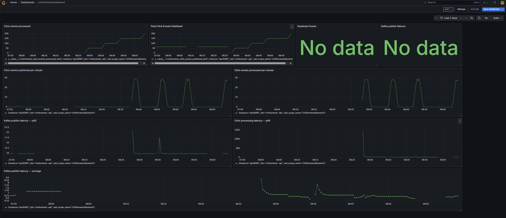

# Observability



The URL Shortener Backend uses OpenTelemetry-based observability to monitor application behaviour, Kafka event processing, and service performance during local development.

The observability stack provides three complementary capabilities:

- **Metrics** for measuring application behaviour and performance.
- **Traces** for following requests and asynchronous event processing across components.
- **Dashboards** for visualising operational data.

## Architecture

The current local observability architecture is:

```text
                         URL Shortener API
                                |
                    +-----------+-----------+
                    |                       |
                 Metrics                  Traces
                    |                       |
                 /metrics                   |
                    |                  OpenTelemetry
                    v                      |
                Prometheus                 Collector
                    |                       |
                    v                 +-----+-----+
                 Grafana              |           |
                                   Jaeger      Future exporters
```

The application is instrumented using OpenTelemetry rather than being coupled directly to a particular monitoring vendor.

## Components

| Component               | Purpose                                    |
| ----------------------- | ------------------------------------------ |
| OpenTelemetry SDK       | Collects application metrics and traces    |
| OpenTelemetry Collector | Receives and forwards trace telemetry      |
| Prometheus              | Scrapes and stores application metrics     |
| Grafana                 | Visualises metrics and provides dashboards |
| Jaeger                  | Stores and visualises distributed traces   |

## Local Endpoints

The local development stack exposes:

| Service    | URL                           | Purpose                     |
| ---------- | ----------------------------- | --------------------------- |
| API        | http://localhost:8080         | Application                 |
| Metrics    | http://localhost:8080/metrics | Prometheus metrics endpoint |
| Prometheus | http://localhost:9090         | Metrics querying            |
| Grafana    | http://localhost:3100         | Dashboards                  |
| Jaeger     | http://localhost:16686        | Distributed tracing         |

The OpenTelemetry Collector communicates internally with the other Docker services and does not need its OTLP ports exposed to the host for the Dockerised application.

## Metrics

The API exposes Prometheus-compatible metrics from the `/metrics` endpoint.

### Built-in Metrics

OpenTelemetry instrumentation collects application and runtime telemetry including:

- ASP.NET Core HTTP request metrics
- .NET runtime metrics
- .NET process metrics

### Custom Application Metrics

The application also exposes custom metrics for Kafka-based click processing.

#### Click Events Published

```text
urlshortener_click_events_published_total
```

Counts successfully published click events.

Example query:

```promql
urlshortener_click_events_published_total
```

Events published per second:

```promql
rate(urlshortener_click_events_published_total[5m])
```

#### Click Events Processed

```text
urlshortener_click_events_processed_total
```

Counts click events successfully processed by the consumer.

Example query:

```promql
urlshortener_click_events_processed_total
```

Events processed per second:

```promql
rate(urlshortener_click_events_processed_total[5m])
```

#### Duplicate Click Events

```text
urlshortener_click_events_duplicates_total
```

Counts duplicate events skipped by the idempotency mechanism.

#### Kafka Publish Failures

```text
urlshortener_click_events_publish_failures_total
```

Counts click events that failed to publish to Kafka.

#### Kafka Publish Duration

```text
urlshortener_kafka_publish_duration_milliseconds
```

A histogram measuring Kafka publish latency.

Average publish latency:

```promql
rate(urlshortener_kafka_publish_duration_milliseconds_sum[5m])
/
rate(urlshortener_kafka_publish_duration_milliseconds_count[5m])
```

p95 publish latency:

```promql
histogram_quantile(
  0.95,
  rate(urlshortener_kafka_publish_duration_milliseconds_bucket[5m])
)
```

#### Click Event Processing Duration

```text
urlshortener_click_events_processing_duration_milliseconds
```

A histogram measuring the duration of click-event processing, including the PostgreSQL update.

p95 processing latency:

```promql
histogram_quantile(
  0.95,
  rate(urlshortener_click_events_processing_duration_milliseconds_bucket[5m])
)
```

## Grafana Dashboard

Grafana is used to visualise the metrics collected by Prometheus.

The current dashboard focuses on the Kafka click-processing pipeline.

Recommended headline panels:

- Click Events Published
- Click Events Processed
- Duplicate Click Events
- Kafka Publish Failures

Recommended time-series panels:

- Kafka Events Published / Second
- Kafka Events Processed / Second
- Kafka Publish Latency
- Click Event Processing Latency

A useful dashboard layout is:

```text
+----------------------+----------------------+----------------------+
| Events Published     | Events Processed     | Duplicate Events    |
+----------------------+----------------------+----------------------+
| Kafka Publish Rate   | Click Processing     | Publish Failures    |
|                      | Rate                 |                     |
+----------------------+----------------------+----------------------+
| Kafka Publish p95    | Processing p95       |                     |
+----------------------+----------------------+----------------------+
```

The dashboard should normally be viewed over the **last 15 minutes** during local development and configured to refresh every few seconds when actively testing the system.

## Tracing

The application uses `ActivitySource` to create application-level spans.

The current tracing model includes:

```text
HTTP request
    |
    +-- Redis operation
    |
    +-- kafka.publish
            |
            v
        Kafka topic
            |
            v
    click_event.process
            |
            v
       PostgreSQL
```

Kafka trace context is propagated through Kafka message headers so the consumer can continue the trace created by the producer.

### Trace Attributes

Kafka spans include useful information such as:

```text
messaging.system
messaging.destination.name
messaging.kafka.partition
messaging.kafka.offset
urlshortener.event_id
urlshortener.short_code
```

These attributes make it possible to identify which Kafka event and partition are associated with a trace.

## OpenTelemetry Collector

The collector receives OTLP trace data from the application and forwards it to Jaeger.

The configuration is located at:

```text
src/UrlShortenerBackend/Observability/otel-collector-config.yaml
```

The collector configuration currently contains:

```text
OTLP receiver
    |
    v
batch processor
    |
    v
Jaeger exporter
```

The Dockerised API sends telemetry to:

```text
http://otel-collector:4317
```

Host-based local development can use the locally available collector endpoint when required.

## Prometheus Configuration

The Prometheus configuration is located at:

```text
src/UrlShortenerBackend/Observability/prometheus.yml
```

Prometheus scrapes the Dockerised API using the Docker Compose service name:

```text
api:8080/metrics
```

The current scrape interval is:

```text
5 seconds
```

This provides sufficiently frequent samples for local dashboard development and rate-based queries.

## Running the Observability Stack

From the repository root:

```bash
docker compose --env-file .env.local up -d
```

Check that the observability containers are running:

```bash
docker ps
```

The expected containers are:

```text
urlshortener-otel-collector
urlshortener-jaeger
urlshortener-prometheus
urlshortener-grafana
```

## Verifying Metrics

Check the API metrics endpoint:

```bash
curl http://localhost:8080/metrics
```

To inspect the custom application metrics:

```bash
curl -s http://localhost:8080/metrics | grep "^# TYPE urlshortener"
```

Check Prometheus:

```text
http://localhost:9090
```

The API target should be shown as:

```text
urlshortener-api    UP
```

## Generating Telemetry

Generate a redirect:

```bash
curl -i http://localhost:8080/YOUR_SHORT_CODE
```

This should result in:

```text
HTTP request
    |
    +-- click event published
            |
            +-- Kafka consumer processing
                    |
                    +-- PostgreSQL click-count update
```

The corresponding metrics should then become visible in Prometheus and Grafana.

## Testing Observability

Observability should be tested alongside the application rather than treated as an independent feature.

### Normal Click Processing

```text
Redirect
  -> Kafka publish
  -> Consumer processing
  -> Click count update
```

Expected results:

- Published events increase.
- Processed events increase.
- Publish failures remain unchanged.
- Processing latency is recorded.

### Duplicate Event

Publishing the same event twice should result in:

```text
Published events  +2
Processed events  +1
Duplicate events  +1
```

The click count should only increase once because of the idempotency mechanism.

### Kafka Failure

Stopping Kafka:

```bash
docker stop urlshortener-kafka
```

should allow the failure telemetry and application logs to be observed.

The current application deliberately waits for Kafka acknowledgement before returning the redirect, so Kafka availability currently affects the redirect path.

Failure-handling behaviour is planned as part of the resilience work.

## Future Improvements

The current observability implementation is intentionally focused on establishing a useful foundation.

Planned improvements include:

- PostgreSQL tracing instrumentation
- Liveness and readiness endpoints
- Additional business-level metrics
- Kafka consumer lag monitoring
- Alerting
- Grafana dashboard provisioning
- More detailed HTTP latency dashboards
- Trace correlation improvements
- Resilience/failure dashboards
- Cloud-based telemetry
- AWS monitoring integration

The same OpenTelemetry instrumentation can be retained when the application moves to AWS, allowing the observability backend to evolve without tightly coupling application code to Grafana, Jaeger, or another specific vendor.

## Directory Structure

```text
src/UrlShortenerBackend/Observability/
├── README.md
├── UrlShortenerActivitySource.cs
├── UrlShortenerMetrics.cs
├── otel-collector-config.yaml
└── prometheus.yml
```
